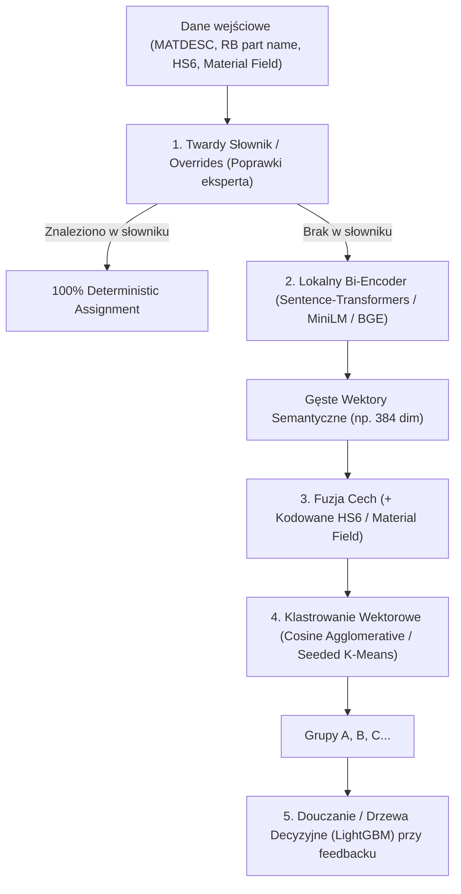

# Architektura Lokalnego Klastrowania Części & Roadmapa

## 1. Kontekst i Cele Projektu
- **Problem**: Chmurowe klastrowanie LLM (Bosch Model Farm) generuje wysokie koszty tokenów, jest podatne na opóźnienia i brak determinizmu.
- **Wymaganie kluczowe**:
  1. Klastrowanie w 100% lokalne, szybkie i niewymagające zasobożernych lokalnych LLM (typu Qwen/Llama), aby komputer pracował cicho i stabilnie.
  2. Podejście dwuetapowe (**Cluster-then-Label**): najpierw podział na anonimowe grupy o wysokiej spójności, a dopiero potem nazwanie grup (tani prompt zbiorczy lub heurystyka).
  3. Mechanizm **Human-in-the-Loop**: możliwość trwałego przypisania części do wybranego klastra ("ta część ma być ZAWSZE w tym klastrze") oraz douczanie się systemu na tych poprawkach.

---

## 2. Istniejąca Ewaluacja (Ground Truth i Metryki)
- **Źródło prawdy**: `data_to_cluster/to_cluster_rudolf.xlsx` (kolumna `Cluster NAME`) lub `cla.csv`. Wiersze z etykietą `tbd` są ignorowane.
- **Zasada**: Nazwy klastrów są ignorowane (`A-Z` wg wielkości) – oceniana jest wyłącznie jakość grupowania rekordów.
- **Główne metryki**:
  - **Zgodność Hungarian (`linear_sum_assignment`)**: optymalne dopasowanie 1:1 grup modelu do grup Rudolfa i odsetek poprawnie sklasyfikowanych rekordów.
  - **Pair F1 / Pair Precision / Pair Recall**: ocena na parach rekordów (czy pary, które powinny być razem, są razem).
  - **ARI (Adjusted Rand Index)**: skorygowany o przypadek wskaźnik zgodności podziału (baseline TF-IDF = ~0.60, chmurowy LLM = ~0.885).

---

## 3. Planowana Architektura Techniczna

1. **Warstwa 1 (Twardy słownik reguł)**:
   - Każdy PN zatwierdzony przez człowieka ma sztywne przypisanie – zero kosztów, 100% determinizmu.
2. **Warstwa 2 (Lekki Bi-Encoder neuronowy)**:
   - Model `all-MiniLM-L6-v2` lub `bge-small-en-v1.5` (< 100 MB).
   - Generuje wektory z opisów w kilka sekund na zwykłym CPU (brak wycia wentylatorów).
3. **Warstwa 3 (Klastrowanie wektorowe)**:
   - `AgglomerativeClustering(metric='cosine', linkage='average')` lub `Seeded K-Means` dla ~50–70 klastrów funkcjonalnych.
4. **Warstwa 4 (Drzewa decyzyjne / LightGBM)**:
   - Klasyfikator na wektorach do błyskawicznego douczania w tle, gdy użytkownik koryguje przypisania.

---

## 4. Rejestr Pomysłów na Kolejne Etapy (Roadmapa)

- **[Etap 2] Nazywanie Klastrów (Cluster Naming via Cloud LLM)**:
  - Z każdego powstałego klastra bierzemy 3–5 próbek najbliższych centroidu.
  - Wykonujemy **1 pojedyncze zapytanie do LLM** dla wszystkich 50 klastrów naraz, aby nadać techniczne nazwy (`BALL`, `SENSOR`, `SEAL`).
  - Redukcja kosztów API o ponad 99%.
- **[Etap 3] Integracja w UI (`workflow-ui`)**:
  - Podgląd klastrów, miara pewności (`distance to centroid`).
  - Funkcja "Przypnij część na stałe do klastra" i przycisk "Zapisz i doucz model".
- **[Etap 4] Ratunkowy Agent Ekstrakcji Wymiarów (`search_agent`)**:
  - Połączenie z istniejącym w repozytorium modułem `search_agent/` (Docupedia / Web / Datasheet).
  - W przypadku części o niskiej pewności klastrowania (np. enigmatyczny opis) agent wyciąga wymiary fizyczne i wagę, aby precyzyjnie doklastrować detal.

---

## 5. Rekomendacja Modeli do Programowania
- **Eksploracja i dyskusja**: Gemini 3.8 Flash (High) – szybki i responsywny.
- **Implementacja ML i precyzyjne algorytmy**: Gemini Pro lub Claude 3.5 Sonnet / Opus – maksymalna dokładność w logice bibliotek scikit-learn/scipy/torch.
