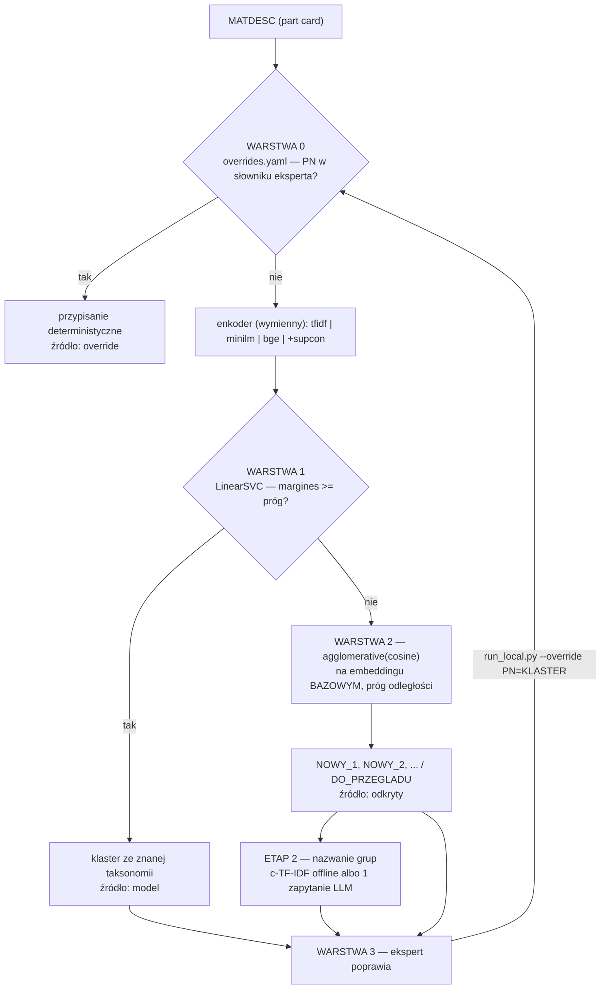

# Architektura Lokalnego Klastrowania Części

> Stan: **zaimplementowane i zmierzone**. Wszystkie liczby w tym dokumencie pochodzą
> z `to_cluster.csv` (3581 wierszy → 1025 PN, 962 PN z etykietą Rudolfa, 77 klas)
> i są liczone **out-of-fold** — nigdy na danych, na których model się uczył.
> Odtworzenie: `python run_local.py --porownaj --sim-nowe 0.2`

## 0. Jeden proces — co się dzieje po kliknięciu „Cluster parts"

```
   część (opis materiałowy)
        │
        ├─ [0] overrides.yaml — przypięta przez eksperta?          → koniec, 100% pewne
        │
        ├─ [1] klasyfikator uczony na częściach już opisanych
        │      margines pewności wystarczający?                     → znany typ
        │
        └─ [2] niepewne ALBO typ, którego nie zna
               fraza typu + cechy fizyczne → grupowanie
               → nazwanie przez LLM → kolejka do przeglądu
                        │
        [3] ekspert poprawia ────┘  poprawka wraca do warstwy 0 i do treningu
```

Zmierzone uczciwie (out-of-fold, na wierszach, części z `to_cluster`):

| trening | trafność | ARI | klas w taksonomii |
|---|---|---|---|
| tylko `to_cluster` (962 PN) | 96.8% | 0.958 | 64 |
| **+ `cla_bez_tbd.xlsx` (2074 PN)** | **95.7%** | 0.956 | **99** |
| *odniesienie: chmura, ~45 zapytań* | – | *0.885* | – |

Dodatkowy korpus kosztuje 1.1 pp trafności, ale rozszerza taksonomię z 64 do 99 klas.
Spadek ma znaną przyczynę: dwie wersje podziału tworzą bliźniacze klasy (`BALL` obok
`BALL JOINT`, `COIL` i `MAGNET` obok `COIL / MAGNET`). Dla systemu, do którego trafią
części typów spoza `to_cluster`, pokrycie jest warte tej ceny. Wyłącza się flagą
`--bez-dodatkowych`.

**Każda część dostaje propozycję.** Nawet ta, która w warstwie 2 została sama — zamiast
wpadać do worka `NEEDS_REVIEW` dostaje własną nazwę z frazy typu (`NEW: WIRE SOLDER`).
Niepewność to osobna flaga `needs_review`, nie brak odpowiedzi. Ekspert w kolejce widzi
propozycję do zaakceptowania, a nie pustkę.

### Tryb `discover` — tylko na zimny start

Zbiór, dla którego **nikt nic nie opisał**, nie ma na czym uczyć warstwy 1. Wtedy
`run_local.py --tryb discover` buduje podział od zera (ARI 0.704, opis niżej). To nie jest
codzienna ścieżka i dlatego nie ma go w UI — skoro ekspert coś już opisał, ignorowanie tej
pracy przy każdym uruchomieniu nie ma sensu.

## 0a. Tryb `discover` — jak działa

```
MATDESC                             1025 części
   │
   ├─ [1] FRAZA TYPU — z opisu wycinamy sam typ części
   │      "helical spring | SPRING; IBO2"           -> SPRING
   │      "rubber gasket | SEPARATING SEAL; D 25.4" -> SEPARATING SEAL
   │      1025 części  ->  ~274 unikalnych fraz
   │
   ├─ [2] FIZYKA — waga, objętość, wartość i gęstość na sztukę
   │      O-RING 0.2 g | BALL 1.4 g | ŚRUBA 5.5 g | SENSOR 32 g | ECU 525 g
   │      W danych wypełnione w 100%. Rozdziela typy, których opis nie rozróżnia.
   │
   ├─ [3] GRUPOWANIE FRAZ w typy funkcjonalne
   │      cloud — JEDNO zapytanie do LLM na wszystkie frazy
   │      local — aglomeracja na tekście frazy + fizyce, w pełni offline
   │
   └─ [4] PRZYPISANIE części do grupy jej frazy + overrides eksperta
```

### Dlaczego akurat tak — pomiary

| metoda, **bez etykiet Rudolfa**, k=77 | ARI |
|---|---|
| sam opis, TF-IDF + aglomeracja (stary baseline) | 0.599 |
| + ekstrakcja frazy typu | 0.655 |
| **+ fizyka (waga 0.3)** | **0.715** |
| chmura, ~45 zapytań agentowych | 0.885 |
| **sufit tej architektury** (frazy pogrupowane idealnie) | **0.980** |

Dwie rzeczy z tej tabeli są istotne:

1. **Fizyka realnie pomaga.** Waga na sztukę to sygnał niezależny od tekstu i rozciąga się
   przez pięć rzędów wielkości. Optimum 0.3 sprawdzone na rozłącznych połowach danych
   (0.699 ± 0.016), więc nie jest dopasowane do zbioru oceny. Powyżej 0.4 fizyka zaczyna
   topić opis (0.4 → 0.585).

2. **Wąskim gardłem nie jest architektura, tylko grupowanie fraz.** Sufit to 0.980 —
   gdyby te ~274 frazy pogrupować dokładnie tak jak Rudolf, wynik byłby znacznie powyżej
   chmury. Samą frazą nie da się uratować tylko 2.2% części (21 sztuk), bo ich fraza trafia
   do kilku klas naraz (`BALL` → BALL vs BALL JOINT, `COVER` → CLIP & CLAMP vs COVER ECU).

### Jak mierzymy — i dlaczego wcześniej mierzyliśmy źle

Raportowałem ARI liczone **tylko na częściach, których system był pewny**, a tor chmurowy
mierzy się **na wszystkich wierszach**. To nie było porównywalne i zawyżało nasz wynik.

Dodatkowo kod podmieniał nazwę klastra niepewnej części na `NEEDS_REVIEW`. 15% części
lądowało w jednym worku, co samo w sobie zbijało porównywalne ARI o ponad 0.2 — bo chmura
**zgaduje każdą część**, a my odmawialiśmy odpowiedzi.

Teraz każda część zachowuje swoją propozycję, a niepewność jest osobną flagą
(`needs_review`). Ekspert w kolejce widzi „raczej SEAL, ale słabo" zamiast `NEEDS_REVIEW`,
a pomiar jest uczciwy. Raportowane są dwie liczby:

| miara | co znaczy |
|---|---|
| **ARI (wszystkie wiersze, pełne pokrycie)** | **porównywalna z torem chmurowym — ta się liczy** |
| ARI na częściach pewnych | węższy widok pomocniczy, zawsze wyższy |

Efekt zmiany na grupowaniu lokalnym: porównywalne ARI 0.484 → **0.666**.

### Granulacja taksonomii

Pierwszy przebieg na Model Farm dał **43 typy** przy 77 u eksperta — wyraźnie za grubo,
a zbyt grube scalanie kosztuje w ARI tyle samo co zbyt drobne rozbicie.

Przyczyna jest w partiach: model widzi 90 fraz z 274, więc polecenie „40–90 grup w całym
zbiorze" jest dla niego nieweryfikowalne. Teraz cel jest **przeliczany na partię** („ta
porcja powinna użyć ok. 20–30 nazw grup, z tego ok. N nowych"), co model może faktycznie
zrealizować.

Docelowa granulacja (`docelowo_typow`, domyślnie 60–90) to decyzja produktowa o tym, jak
drobny ma być podział — nie parametr do strojenia pod wynik. Tor chmurowy w tym repo celuje
w 40–90; zawęziliśmy do 60–90 po zobaczeniu, że 43 to za mało.

### Grupowanie fraz przez LLM — partiami

Pierwsza wersja wysyłała wszystkie ~274 frazy w jednym zapytaniu i kazała modelowi
przepisać je z powrotem w tablicach `members`. Na prawdziwym Model Farm odpowiedź została
**ucięta po 304 tokenach wyjścia** — JSON urwał się w połowie pierwszej grupy, parser rzucił
wyjątek i całe grupowanie spadło na lokalny fallback (`phrases_grouped_by_llm: 0`).

Trzy poprawki:

1. **Zwięzły format odpowiedzi.** Frazy są numerowane, model zwraca `{"1": "GRUPA"}` zamiast
   przepisywać pełne teksty. Kilka razy mniej tokenów wyjścia na frazę.
2. **Partie po 90 fraz.** Każda kolejna dostaje listę już utworzonych grup, żeby nie mnożyć
   near-duplikatów. 274 frazy = 4 zapytania (wobec ~45 w torze chmurowym).
3. **Odporność na obcięcie.** Gdy JSON i tak się nie sparsuje, ratowane są kompletne pary
   `"numer": "grupa"`. Nieudana partia nie psuje reszty — te frazy idą lokalnie, pozostałe
   zostają.

### Próg lokalnego fallbacku

Domyślne 0.55 dawało 148–165 mikro-typów (55 grup jednoelementowych). Zmierzone na
rozłącznych połowach, 4 losowania:

| próg | typów | ARI |
|---|---|---|
| 0.55 | 148 | 0.657 |
| 0.70 | 119 | 0.706 |
| **0.75 (obecny)** | **102** | **0.740** |
| 0.85 | 76 | 0.721 |

### Czego tekst nie zrobi nigdy

Policzone na parach fraz należących u Rudolfa do tej samej klasy:

- **43.8%** par ma wspólne słowo — da się złapać lekykalnie
- **56.2%** par nie ma żadnego wspólnego słowa — potrzebna wiedza o produktach

Przykłady z tej drugiej grupy: `BRACKET` + `GUIDE RING`, `BA CLIP` + `CABLE TIE`,
`CLEVIS` + `INPUT ROD TIP`, `ANTI-CORROSION OIL` + `LUBRICATING GREASE`. Żaden algorytm
tekstowy tego nie połączy. To dokładnie ta luka, którą zamyka jedno zapytanie do LLM —
i powód, dla którego grupowanie `cloud` jest domyślne.

### Douczanie w trybie `discover`

Korekta eksperta działa na **poziomie frazy**, nie pojedynczej części. Gdy przypniesz część
do innego klastra, wszystkie części o tej samej frazie typu idą za tą decyzją.

Zweryfikowane: jedno przypięcie `0204254243` do nowego klastra `BALL BEARINGS` przeniosło
**25 części**, łącznie z wariantami `-KUGEL` i `-STANDARD`, bo ekstrakcja sprowadza je do
tej samej frazy `BALL`.

Zabezpieczenie: fraza jest przemapowana tylko wtedy, gdy **wszystkie** korekty dla niej
wskazują ten sam klaster. Gdy ekspert przypiął dwie części o tej samej frazie do różnych
klastrów, fraza jest wieloznaczna i zostają same przypięcia per PN.

---

## 1. Kontekst i cele

- **Problem**: chmurowe klastrowanie LLM (Bosch Model Farm) kosztuje, jest wolne i niedeterministyczne.
- **Wymagania**:
  1. 100% lokalnie, szybko, bez ciężkich lokalnych LLM (komputer ma pracować cicho).
  2. Mechanizm **human-in-the-loop** — trwałe przypisanie części do klastra i douczanie na poprawkach.
  3. Wykrywanie **nowych typów** części, nie tylko przypisywanie do istniejących.

## 2. Co zmierzyliśmy, zanim napisaliśmy kod

Pierwotny plan zakładał czyste **cluster-then-label** (embedding → klastrowanie → nazwanie grup).
Pomiary pokazały, że ta ścieżka ma niski sufit, a prawdziwe wyniki leżą gdzie indziej:

| podejście | ARI | pair_f1 |
|---|---|---|
| czyste klastrowanie: TF-IDF + agglomerative(cosine, average) | **0.598** | 0.612 |
| chmurowy LLM (Gemini 3.5 Flash, wg README) | 0.885 | – |
| **klasyfikator do znanej taksonomii (LinearSVC, OOF)** | **0.954** | **0.956** |

Czyli: mając ~950 zaetykietowanych PN, zwykły klasyfikator liniowy bije chmurowy LLM
o ~7 pkt ARI, za zero złotych i w kilka sekund. Klastrowanie bez etykiet ma sufit ~0.60.

**Wniosek, który przebudował architekturę**: etykiety Rudolfa to najcenniejszy zasób w tym
projekcie. Architektura ma z nich korzystać wszędzie tam, gdzie taksonomia jest znana,
a klastrowanie rezerwować dla tego, do czego jest naprawdę potrzebne — **odkrywania typów,
których w taksonomii jeszcze nie ma**.

### 2a. Ablacja cech — mniej znaczy więcej

| tekst wejściowy | ARI (OOF) |
|---|---|
| sam `MATDESC` | **0.948** |
| + opis HS Code | 0.934 |
| + hierarchia produktowa (subclass, statgroup, pclass, BU) | 0.917 |

Dosypywanie kontekstu **rozcieńcza** główny sygnał. Dla klastrowania bez etykiet efekt jest
dramatyczny: 0.599 → 0.304. Dlatego domyślnie do enkodera idzie **tylko `MATDESC`**.
(Kody HS i pole materiałowe opisują *surowiec*, a klaster to *typ funkcjonalny* — to dwie
różne osie, więc mieszanie ich szkodzi.)

### 2b. Sieć neuronowa — gdzie się opłaca, a gdzie nie

Douczony enkoder metryczny (SupCon, PyTorch, uczony na etykietach eksperta) **nie obronił się**:

| enkoder warstwy 1 | trafność (OOF) | ARI (OOF) | pokrycie |
|---|---|---|---|
| `tfidf` | **0.956** | **0.954** | **80.5%** |
| `tfidf+supcon` | 0.946 | 0.937 | 51.7% |

Przy pierwszym pomiarze `+supcon` wyglądał świetnie (ARI 0.991), ale to był **przeciek**:
enkoder trenował się na etykietach, które potem przewidywał. Po wymuszeniu re-treningu
enkodera osobno w każdym foldzie przewaga zniknęła. Backend został w kodzie
(`--encoder tfidf+supcon`) — przy większym zbiorze (`cla.csv`, ~15 tys. wierszy) może się
opłacić — ale **domyślny jest `tfidf`**.

Osobna, ważna obserwacja: uczenie metryczne **nie przenosi się na typy niewidziane w treningu**
(ARI 0.910 → 0.342 na symulacji nowych klas). Dlatego warstwa 2 celowo używa embeddingu
**bazowego**, nie douczonego.

## 3. Zaimplementowana architektura



Każda część dostaje w wyniku kolumnę `zrodlo` (`override` / `model` / `odkryty`) i `pewnosc`,
więc widać, skąd wzięła się każda decyzja.

### Warstwa 1 — klasyfikator, który wie, czego nie wie

Pewność to **margines** = odstęp między najlepszą a drugą klasą w `decision_function`.
Próg nie jest zgadywany, tylko **dobierany automatycznie** z predykcji out-of-fold tak, by
trafność przyjętych osiągnęła zadany cel (`--cel-trafnosci`). Zmierzony kompromis:

| cel | pokrycie | trafność przyjętych | nowe typy wykryte | fałszywy alarm |
|---|---|---|---|---|
| 0.970 | 96.9% | 0.971 | 18.0% | 2.9% |
| 0.980 | 94.8% | 0.981 | 39.3% | 3.2% |
| 0.990 | 91.3% | 0.990 | 52.9% | 3.8% |
| 0.995 | 88.1% | 0.996 | 62.7% | 4.0% |
| **0.999 (domyślne)** | **83.1%** | **1.000** | **79.1%** | 6.3% |

Przy domyślnym progu warstwa 1 **nie myli się na tym, co przyjmuje**, a do eksperta trafia
~17% części — w tym 4 na 5 faktycznie nowych typów. Wartości stabilne (±2 pp przez 5 seedów).

> Testowaliśmy też drugą bramkę — odległość do najbliższego centroidu klasy (klasyczny
> open-set). Dawała +1 pp wykrywalności nowości za 3× więcej fałszywych alarmów, więc
> jej **nie ma** w kodzie.

### Warstwa 2 — odkrywanie nowych typów

`AgglomerativeClustering(distance_threshold, metric="cosine", linkage="average")` — bez
zgadywania liczby klastrów z góry. Próg (`--prog-odkrywania`, domyślnie 0.60) świadomie
ustawiony na **rozdrobnienie zamiast sklejania**:

| próg | wykrytych grup (prawda: 16) | pair_precision |
|---|---|---|
| 0.30 | 82 | 0.991 |
| 0.60 | 55 | 0.985 |
| 0.80 | 32 | 0.963 |

Eksperta łatwiej poprosić o scalenie dwóch czystych grupek niż o rozplątanie jednej błędnie
sklejonej. Grupy poniżej `min_licznosc_nowego` dostają etykietę `DO_PRZEGLADU`.

### Etap 2 — nazwanie odkrytych grup (`naming.py`)

Warstwa 2 umie grupować, ale nie umie nazywać — grupy wychodzą jako `NOWY_1`, `NOWY_2`.
Etap 2 zamienia numery na typy funkcjonalne. Dwie ścieżki, obie zaimplementowane:

| metoda | jak działa | koszt | trafność nazw |
|---|---|---|---|
| `ctfidf` (domyślna) | class-based TF-IDF — terminy charakterystyczne dla grupy względem pozostałych grup | **0 zł, offline** | **77.2% części / 52.0% grup** |
| `llm` | z każdej grupy 5 części najbliższych centroidowi → **jedno** zapytanie na wszystkie grupy | 1 zapytanie | do zmierzenia na Model Farm |

„Trafność nazw" = odsetek części, których proponowana nazwa trafia w ich prawdziwy typ
wg Rudolfa (kryterium tokenowe: `BALL BEARING` trafia w `BALL`, `GASKET SEAL` w `SEAL`).
Liczone na symulacji ukrytych klas, więc model nie widział tych typów w treningu.
Wynik po grupach jest niższy, bo małe grupki liczą się tak samo jak duże.

**Koszt, zmierzony:** nazwanie 31 grup = **1 zapytanie**. Tor chmurowy klasyfikuje te same
dane w partiach po 25 PN, czyli ~41 zapytań plus odkrywanie i konsolidacja taksonomii.
W tokenach różnica jest jeszcze większa: etap 2 wysyła 5 krótkich próbek na grupę
(~155 linii) zamiast pełnych part card dla wszystkich 1025 PN.

Nazwy dostają prefiks `NOWY: `, żeby nie mieszały się z zatwierdzoną taksonomią — to
**propozycje**, które ekspert akceptuje przez `--override`. Gdy dwie grupy dostaną tę samą
nazwę, dopisywany jest numer (`NOWY: BUSHING (1)`, `(2)`) — dwie osobne grupy nie mogą
zniknąć w jednym klastrze tylko dlatego, że heurystyka nazwała je tak samo.

Ścieżkę `llm` można przetestować bez tokenu: `provider: mock` w `config.yaml` obsługuje
zadanie nazywania offline.

### Wynik end-to-end (symulacja: 16 klas / 244 PN ukryte przed modelem)

| miara | wynik |
|---|---|
| nowe typy skierowane do warstwy 2 | 79.1% |
| fałszywy alarm na znanych typach | 6.3% |
| trafność warstwy 1 na tym, co przyjęła | 0.996 |
| jakość grupowania nowych typów (pair_precision) | 0.837 |
| nazwy trafiające w prawdziwy typ (etap 2, `ctfidf`) | 77.2% części |

## 3a. Etap 3 — obsługa z UI (`workflow-ui`)

Zakładka **Local (hybrid)** daje pełną pętlę human-in-the-loop z przeglądarki. Interfejs
jest po angielsku (tak jak zakładka chmurowa), podobnie jak komunikaty w oknie logu.

**Widok domyślny jest celowo minimalny** — pole na klucz API, rozwijane „Advanced settings"
i przycisk uruchomienia. Dwie rzeczy są **zaszyte na stałe**, bo pomiary rozstrzygnęły,
co jest najlepsze:

| zaszyte | dlaczego |
|---|---|
| enkoder `tfidf` | wygrał pomiar: ARI 0.954 vs 0.937 dla `tfidf+supcon` |
| nazywanie przez LLM | 1 zapytanie na cały bieg, koszt pomijalny |

Pozostałe backendy **zostały w kodzie** i są dostępne z CLI (`run_local.py --encoder minilm`,
`--nazywaj ctfidf` itd.) — zniknęły tylko z UI.

### Co jest w „Advanced settings"

- **Review workload** (`--cel-trafnosci`) — jak trafny musi być klasyfikator na tym, co
  przypisuje sam. Bezpieczniej = mniej cichych pomyłek i lepsze wykrywanie nowych typów,
  ale więcej części w kolejce. Przy domyślnym 0.999 klasyfikator nie pomylił się ani raz
  na 83% części, które przyjął.
- **Discovery threshold** (`--prog-odkrywania`) — jak daleko od siebie mogą być dwie części,
  by trafić do jednej odkrytej grupy. Dotyczy **wyłącznie** kolejki do przeglądu, nigdy
  części przypisanych przez klasyfikator.
- **Part-number limit** (`--limit`) — tylko do szybkich testów. Bierze pierwsze N PN
  w kolejności z pliku, a plik jest pogrupowany rodzinami produktów, więc mała próbka jest
  mocno przekrzywiona (np. pierwsze 300 PN zawiera 18 sztuk VM-ESP, a w całości jest ich 386).
  Przy ustawionym limicie ewaluacja na wierszach jest pomijana, bo etykiety Rudolfa są
  wyrównane pozycyjnie z pełnym plikiem.

### Klucz API

Pole w zakładce zapisuje token do `agentic/config.yaml` (zakłada plik na bazie
`config.example.yaml`, jeśli go nie ma). Klucz **nigdy nie wraca do przeglądarki** — UI
dostaje tylko flagę `llmReady`. To ten sam plik, którego używa tor chmurowy.

**Nazywanie przez LLM nie może wywrócić biegu.** Brak `config.yaml`, wygasły token, padnięty
endpoint albo niepoprawny JSON — wszystko spada na offline'owe c-TF-IDF, a użytkownik dostaje
komplet wyników, tylko z gorszymi nazwami grup. Osłonięte jest całe wywołanie, razem z częścią
sieciową (zweryfikowane na realnym błędzie połączenia).

### Reszta zakładki

- **Kafelki metryk**: trafność OOF, ARI, udział przypisanych automatycznie, liczba części
  do przeglądu. To liczby out-of-fold, nie z danych treningowych.
- **Lista klastrów** z licznością; grupy zaproponowane przez etap 2 mają ikonę iskierki.
- **Tabela części** posortowana rosnąco po marginesie pewności — najbardziej wątpliwe są
  na górze. Kolumna `Assigned by` pokazuje, która warstwa podjęła decyzję
  (`model` / `discovered` / `override`). Filtr „review queue only" zawęża do kolejki eksperta.
- **Pin permanently**: w każdym wierszu pole z podpowiedziami istniejących klastrów
  (można też wpisać zupełnie nową nazwę). Korekty zbierają się w koszyku, a przycisk
  **„Save and retrain"** zapisuje je do `overrides.yaml` i od razu przelicza model.

**Uwaga projektowa**: korekta eksperta wchodzi do treningu **zawsze**, nawet jako jedyny
przykład swojej klasy (`min_probek_klasy` jej nie dotyczy). Bez tego przypięcie części do
zupełnie nowego klastra działałoby wyłącznie dla tego jednego PN, a podobne części dalej
lądowałyby gdzie indziej — czyli model niczego by się nie nauczył.

## 4. Użycie

```bash
cd agentic

python run_local.py                          # pełny przebieg + uczciwa ewaluacja
python run_local.py --porownaj --sim-nowe 0.2   # z porównaniem torów i symulacją nowych typów
python run_local.py --encoder tfidf+supcon   # enkoder neuronowy (PyTorch, offline)
python run_local.py --encoder minilm         # bi-encoder z HuggingFace
python run_local.py --cel-trafnosci 0.98     # więcej automatyzacji, mniej odkrywania
python run_local.py --nazywaj llm            # etap 2 przez LLM (1 zapytanie) zamiast c-TF-IDF
python run_local.py --nazywaj brak           # zostaw surowe NOWY_1, NOWY_2
python run_local.py --predict-only           # użyj zapisanego modelu

# WARSTWA 3 — poprawka eksperta (trafia do overrides.yaml i uczy model)
python run_local.py --override "0204X00136=RESERVOIR CAP"
```

Wyniki lądują w `wyniki/<data>_local_<enkoder>/`: `klastry_per_PN.csv`,
`klastry_per_wiersz.csv`, `legenda_klastrow.csv`, `podsumowanie.txt`, `ewaluacja.txt`.

> `ewaluacja.txt` liczy metryki na wierszach dla modelu dotrenowanego na **wszystkich**
> etykietach — te liczby są **zawyżone** i służą tylko do porównania z historycznymi
> przebiegami chmurowymi. Miarodajna jest sekcja A w `podsumowanie.txt` (out-of-fold).

## 5. Zależności

Rdzeń (`tfidf`) wymaga tylko `pandas`, `scikit-learn`, `scipy`, `PyYAML`, `openpyxl` —
wszystko już jest w `requirements.txt`. Opcjonalnie:

```bash
pip install torch                    # backend +supcon
pip install sentence-transformers    # backendy minilm / bge (pobiera model z HuggingFace)
```

## 6. Co dalej (roadmapa)

- **[Etap 2] ✅ ZROBIONE** — `naming.py`, opis wyżej.
- **[Etap 3] ✅ ZROBIONE** — zakładka „Lokalne (hybryda)" w `workflow-ui`, opis niżej.
- **[Etap 4] `search_agent` jako ratunek**: dla części z `DO_PRZEGLADU` o enigmatycznym opisie
  wyciągnąć wymiary i wagę z kart katalogowych i doklastrować detal.
- **Walidacja na `cla.csv`**: większy zbiór (~15 tys. wierszy) — tam `+supcon` może się obronić.
  Uwaga: `dataset_train.csv` / `dataset_test.csv` **nie nadają się** do uczciwej ewaluacji —
  1166 z 1363 PN testowych występuje też w treningu (przeciek), a pliki nie zawierają `MATDESC`.

## 7. Mapa plików

| plik | rola |
|---|---|
| `encoders.py` | wymienne enkodery: `tfidf`, `st:<model>`, `+supcon` (PyTorch) |
| `local_clustering.py` | warstwy 0–3, dobór progu, zapis/odczyt modelu |
| `discover.py` | tryb `discover`: fraza typu, cechy fizyczne, grupowanie fraz, douczanie |
| `naming.py` | etap 2: nazywanie grup (c-TF-IDF offline / 1 zapytanie LLM) + ocena nazw |
| `wyniki/_ostatni_lokalny.json` | ostatni wynik w formacie dla UI (stała ścieżka) |
| `../workflow-ui/src/lib/local.ts` | uruchamianie toru lokalnego i zapis korekt z UI |
| `../workflow-ui/src/app/LocalPanel.tsx` | zakładka „Lokalne (hybryda)" |
| `run_local.py` | CLI, uczciwa ewaluacja OOF, symulacja nowych typów, zapis wyników |
| `overrides.yaml` | słownik eksperta PN → klaster (warstwa 0 / 3) |
| `data_prep.py` | wczytanie danych, deduplikacja do PN, part card |
| `evaluate.py` | metryki (ARI, pair_f1, NMI, Hungarian) — wspólne z torem chmurowym |
